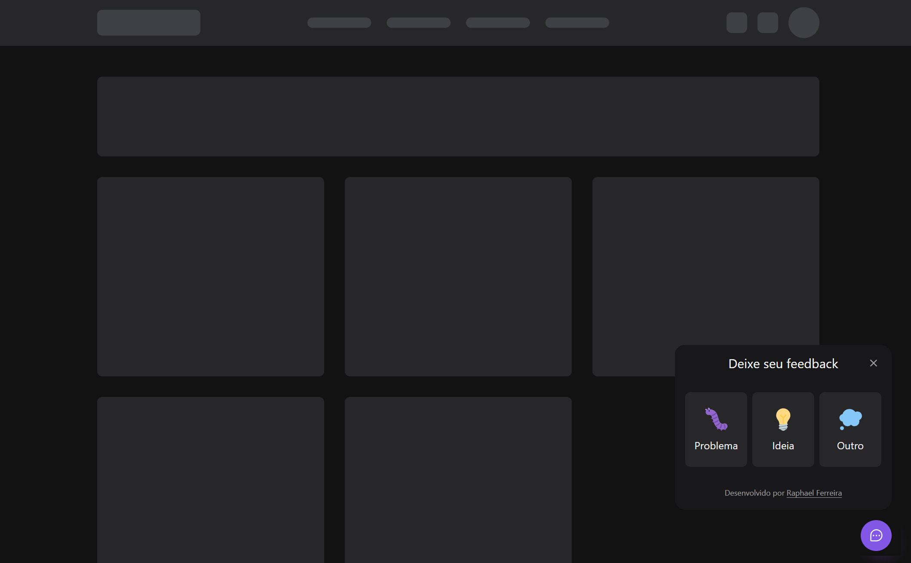
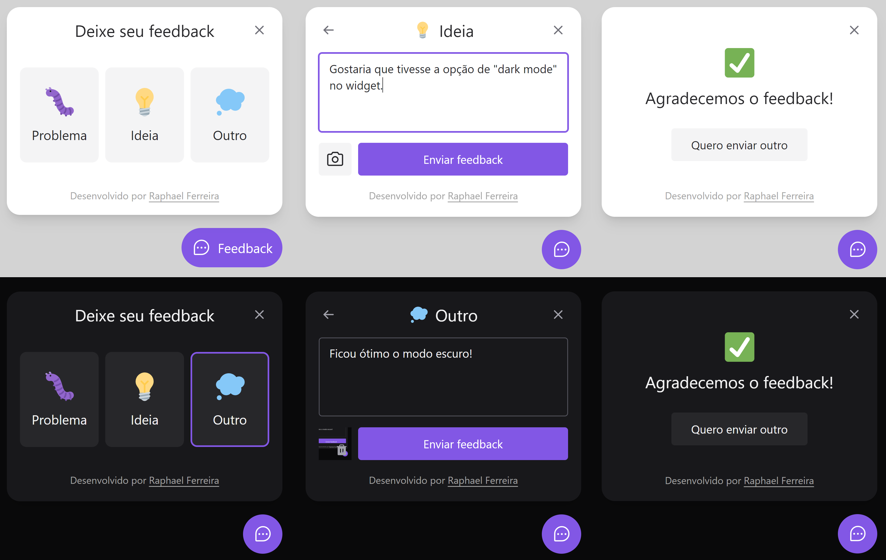

# Feedback Widget

Widget component, integrated to an API to send feedback e-mail with screenshot. This application was created for studies with the NLW, an event organized by [Rocketseat](https://www.rocketseat.com.br/).

## New features

- Added light and dark theme, which uses the appearance of the user's browser to define which one will be displayed.
- Improving tailwindcss classes.

## Stack

- [React / ReactJs](https://pt-br.reactjs.org/)
- [Tailwind / TailwindCSS](https://tailwindcss.com/)
- [Headless / Headless UI](https://headlessui.dev/)
- [Typescript](https://www.typescriptlang.org/)
- [Node / NodeJs](https://nodejs.org/en/)
- [Express](https://expressjs.com/pt-br/)
- [Prisma](https://www.prisma.io/)
- [Jest](https://jestjs.io/)
- [Mailtrap](https://mailtrap.io/)

## Deploy

- Front-end deployed using Vercel.
- Back-end deployed using Railway.

## Test yourself

- https://feedback-widget-five-ebon.vercel.app/

---

## Contact

If you want to contact me, follow my linkedin profile below.

---

Desenvolvido por Raphael Ferreira
